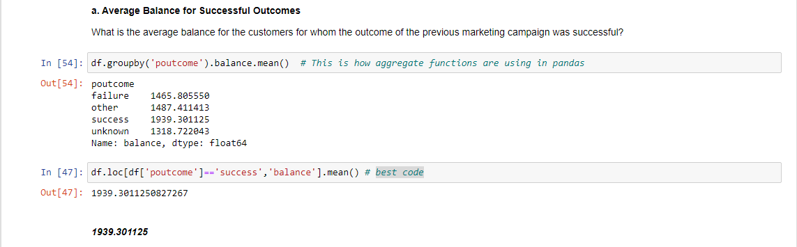
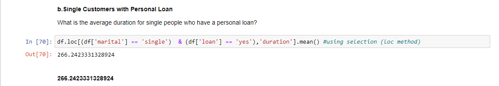
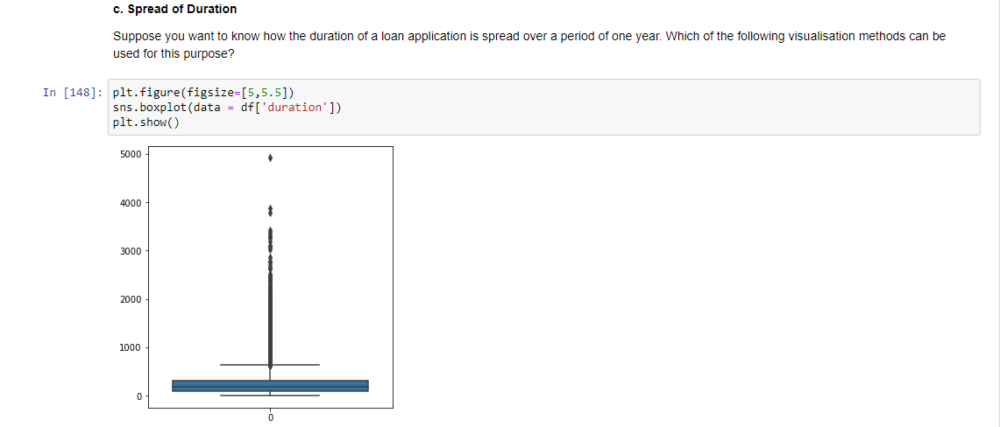
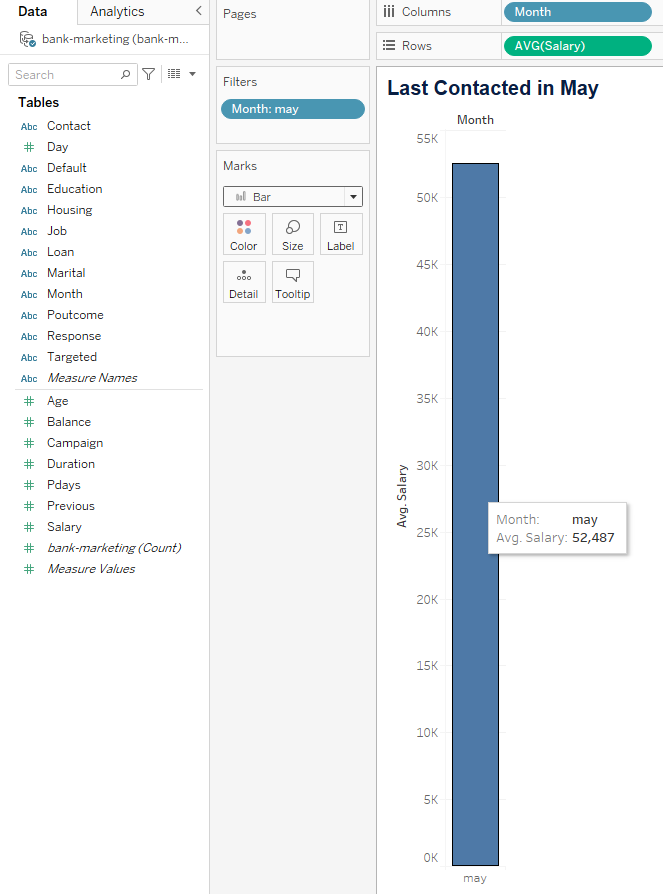
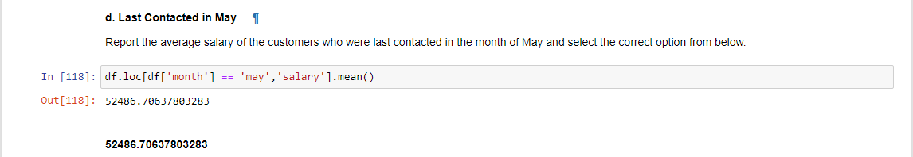

# Tableau VS Python

Answering the same problem using tableau and python.

## 1. Data
The file attached (bank-marketing.xlsx) contain's bank’s existing customer details.

## 2. Loading Data

#### Using tableau

#### Using Python

## 3. Aswering objective questions 

#### a. What is the average balance for the customers for whom the outcome of the previous marketing campaign was successful?

#### Tableau

####  Python

#### b. Single Customers with Personal Loan

#### Tableau

####  Python

#### c. Spread of Duration

#### Tableau

####  Python

#### d. Last Contacted in May

#### Tableau

####  Python

#### e. Percentage Difference in July Salary 

#### Tableau

####  Python

