# Tableau VS Python
Answering the same problem using tableau and python.

## 1. Data
The file attached (bank-marketing.xlsx) contain's bank’s existing customer details.

## 2. Loading Data

### Using tableau  
<kbd>  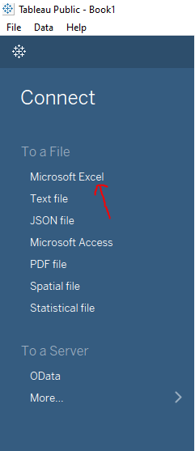  </kbd>

<kbd> 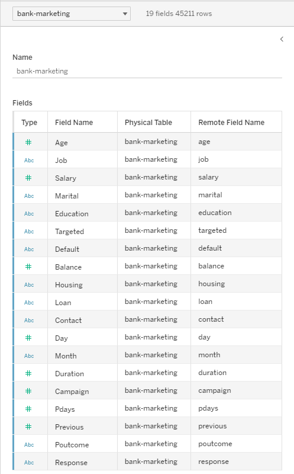 </kbd>
### Using Python 🐍 
<kbd> 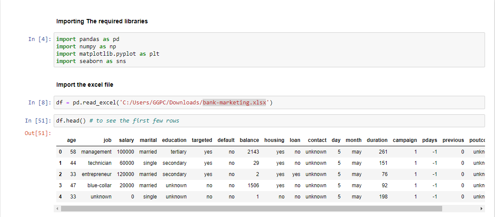 </kbd>
## 3. Aswering objective questions 

#### a. What is the average balance for the customers for whom the outcome of the previous marketing campaign was successful?

### Tableau
<kbd> 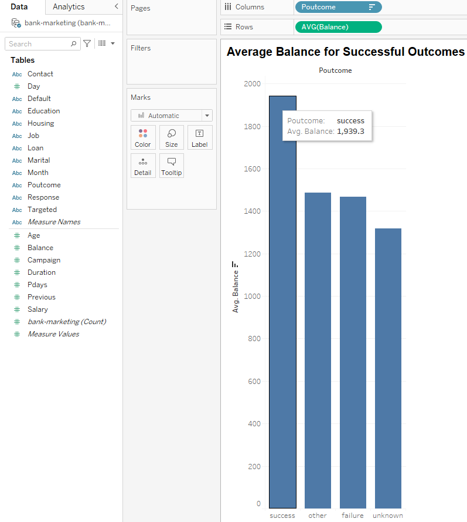 </kbd>
###  Python
<kbd> 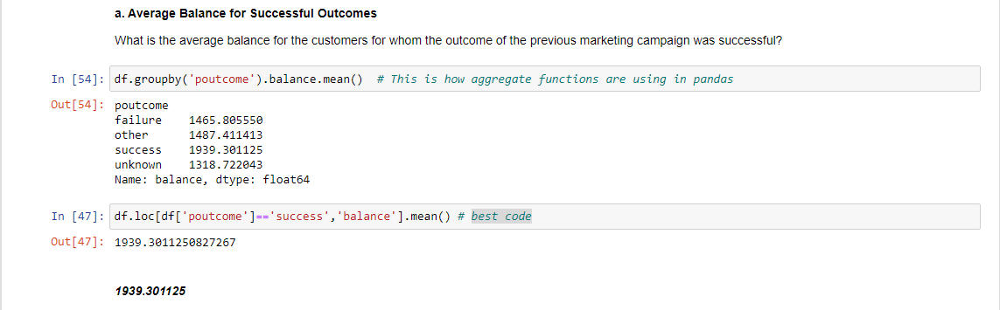 </kbd>

#### b. What is the average duration for single people who have a personal loan?

### Tableau 
<kbd> 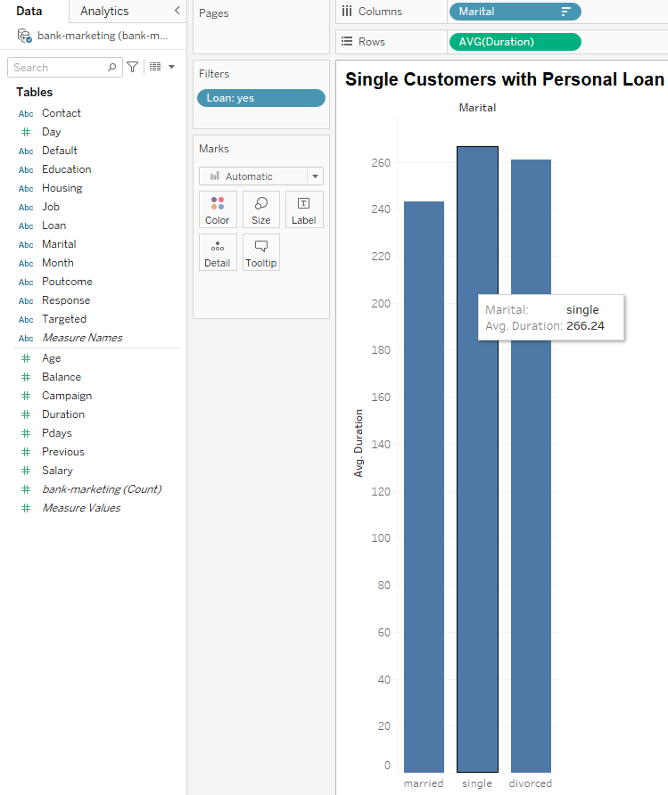 </kbd>
###  Python 🐍
<kbd> 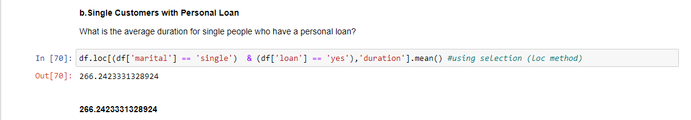 </kbd>

#### c. Suppose you want to know how the duration of a loan application is spread over a period of one year. Which of the following visualisation methods can be used for this purpose?

### Tableau
<kbd> 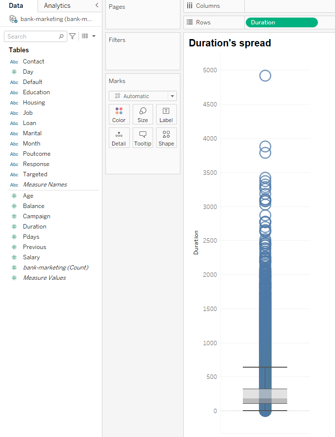 </kbd>
###  Python 🐍
<kbd>  </kbd>
#### d. Report the average salary of the customers who were last contacted in the month of May and select the correct option from below.

### Tableau
<kbd> 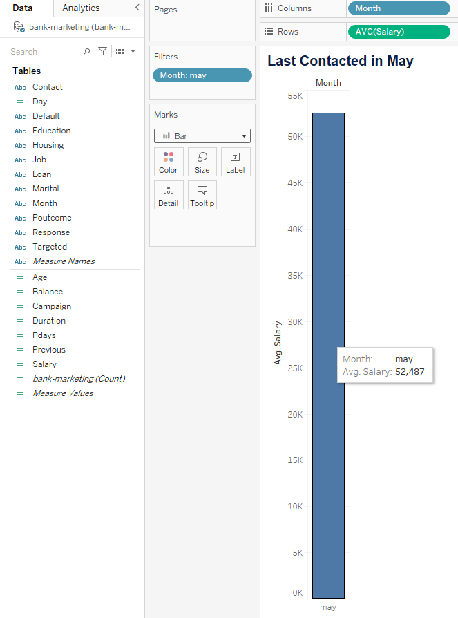 </kbd>
###  Python 🐍
<kbd> 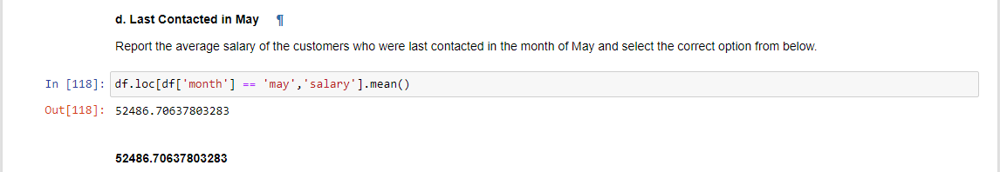 </kbd>

#### e. What is the percentage difference in the average salary for the month of July? (By default, the percentage difference calculation is done between the previous month and the current month).

### Tableau
<kbd> 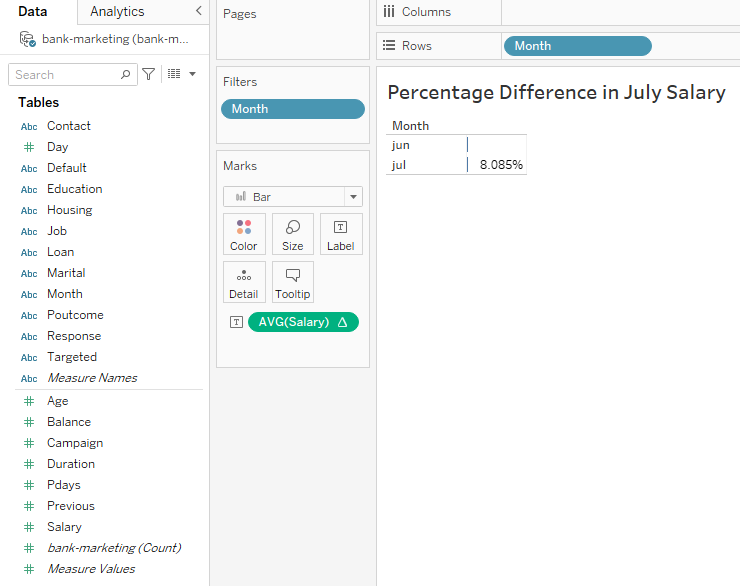 </kbd>
###  Python 🐍
<kbd> 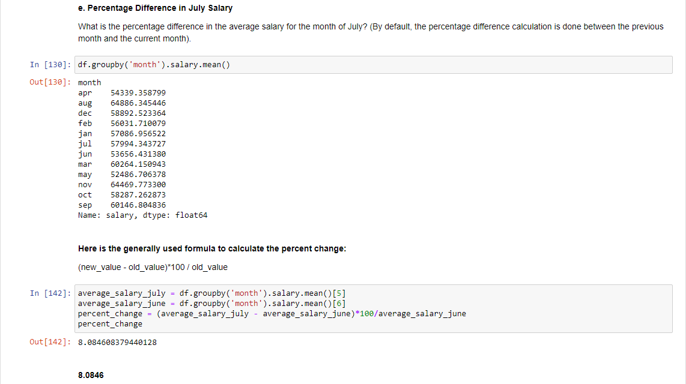 </kbd>
