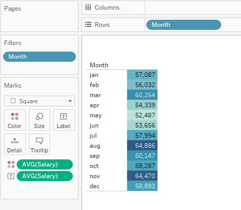
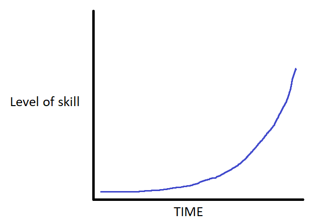
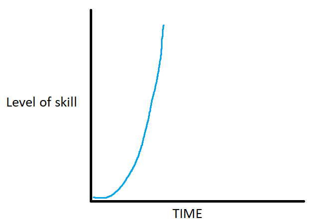

# Tableau VS Python
Answering the same problem using tableau and python.

## 1. Data
[bank-marketing.xlsx](https://github.com/ABHIJITHCV11/Tableau_vs_Python_Which-One-Is-Better/blob/main/bank-marketing.xlsx) contain's bank’s existing customer details.

[ipython notebook](https://github.com/ABHIJITHCV11/Tableau_vs_Python_Which-One-Is-Better/blob/main/Python_analysis..ipynb) contains python analysis.

[Tableau dashbord](https://public.tableau.com/views/BankCustomerAnalysisPythonvsTableau/Dashboard2?:language=en-US&publish=yes&:display_count=n&:origin=viz_share_link) contains Tableau analysis.

## 2. Loading Data

### Using tableau  
<kbd>    </kbd>

<kbd>  </kbd>
### Using Python 🐍 
<kbd>  </kbd>

## 3. Aswering objective questions Using Tableau

#### a. What is the average balance for the customers for whom the outcome of the previous marketing campaign was successful?
<kbd>  </kbd>

#### b. What is the average duration for single people who have a personal loan?
<kbd>  </kbd>

#### c. Suppose you want to know how the duration of a loan application is spread over a period of one year. Which of the following visualisation methods can be used for this purpose?
<kbd>  </kbd>

#### d. Report the average salary of the customers who were last contacted in different months.
<kbd>  </kbd>

#### e. What is the percentage difference in the average salary for the month of July? (By default, the percentage difference calculation is done between the previous month and the current month).
<kbd>  </kbd>

## 3. Aswering objective questions Using Python 🐍

<kbd>  </kbd>

<kbd>  </kbd>

<kbd>  </kbd>

<kbd>  </kbd>

<kbd>  </kbd>

## 4. Which one to choose. 
In some ways, Tableau and Python are similar, and in other ways they are different.
Which one to choose and when depends on the purpose of your analysis and the type of data.
### Python 

- Python is good for data Cleaning, analysis and Machine Learning.
- There are amazing libraries like matplotlib and seaborn for data Visualization. 
- Python is the best when working with a variety of data that requires advanced analytics. 
- In Machine learning, a good workflow will improve the results and will keep a better understanding of the work.
- But all of this will take time to learn. 
### Tableau

- Tableau, provides user-friendly system that simplifies the creation of graphs.
- The graphs in Tableau are more attractive for the end-users who just wants to understand the results and make decisions based on it, but they have limitations.
- Tableau only allows us to do basic preprocessing of data and its difficult to keep track of the workflow.
- Tableau dashbords can play a mojor part in an effective presentation that can assist in better decision making.
